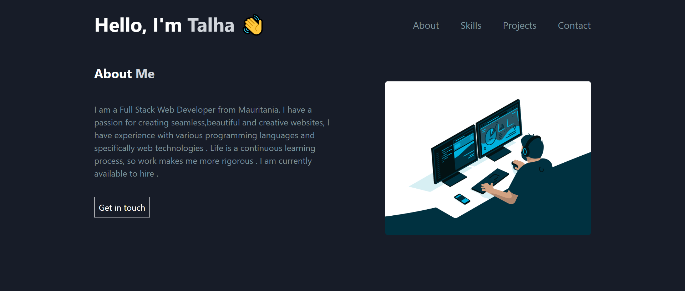

# Portfolio Website

## Overview

This repository contains the code for my personal portfolio website built using React and styled with Tailwind CSS. The website includes multiple pages for showcasing various aspects of my professional profile, such as About, Skills, Projects, and Contact sections. It is fully responsive, ensuring an optimal viewing experience on mobile devices, tablets, and desktops.

## Features

- **Multiple Pages**:
  - **About**: A brief introduction and background information.
  - **Skills**: A list of technical skills and proficiencies.
  - **Projects**: A showcase of selected projects with descriptions and links.
  - **Contact**: Contact information for reaching out.
- **Responsive Design**: Ensures the website looks great on mobile devices, tablets, and desktops.

## Technologies Used


## Getting Started

### Prerequisites

Make sure you have the following installed:

- [Node.js](https://nodejs.org/)
- [npm](https://www.npmjs.com/) or [yarn](https://yarnpkg.com/)

### Installation

1. Clone the repository:

   ```bash
   git clone https://github.com/talhashah-dev/portfolio.git
   ```

2. Navigate to the project directory:

   ```bash
   cd portfolio
   ```

3. Install the dependencies:

   ```bash
   npm install
   ```

   or

   ```bash
   yarn install
   ```

### Running the Project

To start the development server, run:

```bash
npm start
```

or

```bash
yarn start
```

The website will be available at `http://localhost:3000`.

## Contributing

Contributions are welcome! Please fork the repository and create a pull request with your changes.
